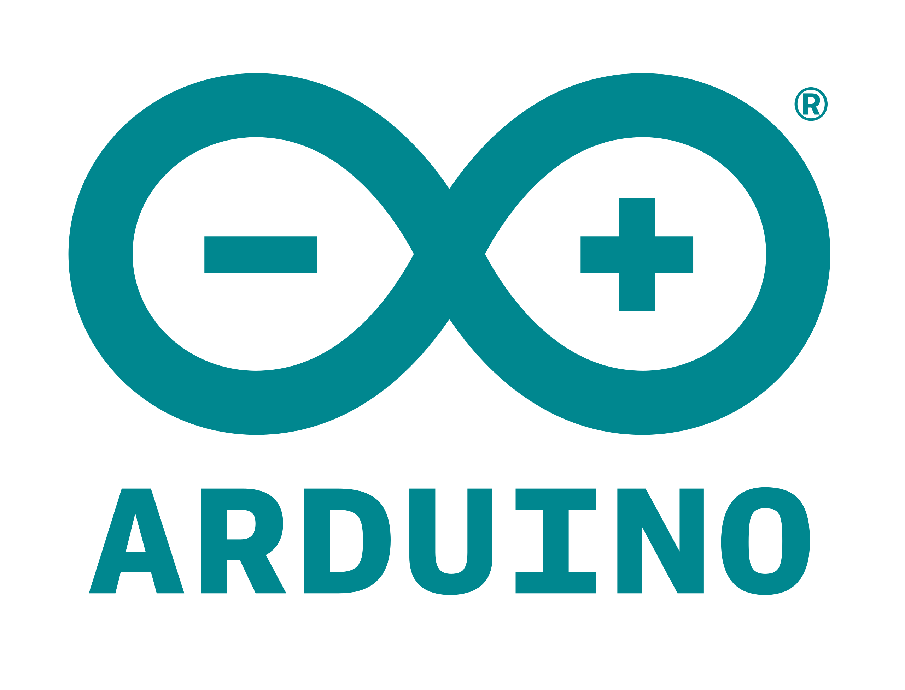

<!-- HEADINGS -->
# Sintaxis GitHub
## My title 2
### My title 3
#### My title 4
##### My title 5
###### My title 6

<!-- Italic -->
This is *italic* text

<!-- Bold -->
This is **bold** text

<!-- strikethrough -->
This in ~~underlined~~ text

<!-- Unordered lists -->
* Banana 
    * Yellow
    * Big
        * Fruit
* Apple
* Orange

<!-- Ordered lists -->
1. Apple
    1. Red 
    2. Circle
        1. Fruit
2. Banana
3. Watermelon

<!-- URL -->
Link: [YouTube](https://www.youtube.com "URL a YouTube")

<!-- Citas -->
> Un gran poder conlleva una gran responsabilidad

<!-- lineas -->
---
___

<!-- Línea de código -->
`Console.log("Hello World")`

<!-- Bloque de código -->
```C
#include <stdio.h>
#include <locale.h>
int main()
{
    setlocale(LC_CTYPE, "spanish");
    printf("Hola mundo");
    return 0;
}
```

<!--Tabla -->
| Nombre | Nacionalidad | Edad |
|--------|--------------|------|
| Gustavo| Sanchez      | 19   |
| Marisol| Potrero      | 8    |
| Vianney| Bonilla      | 20   |

<!-- Imagenes -->




<!-- GITHUB Markdown -->
* [x] Task 1
* [ ] Task 2
* [x] Task 3
* [ ] Task 4
* [x] Task 5

<!-- Emoji -->
[Emoji GitHub](https://gist.github.com/rxaviers/7360908 "Emojis URL")

:sparkles: